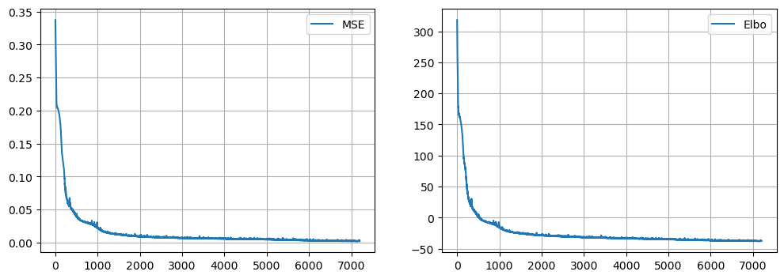
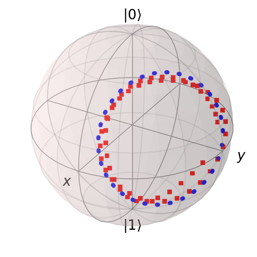
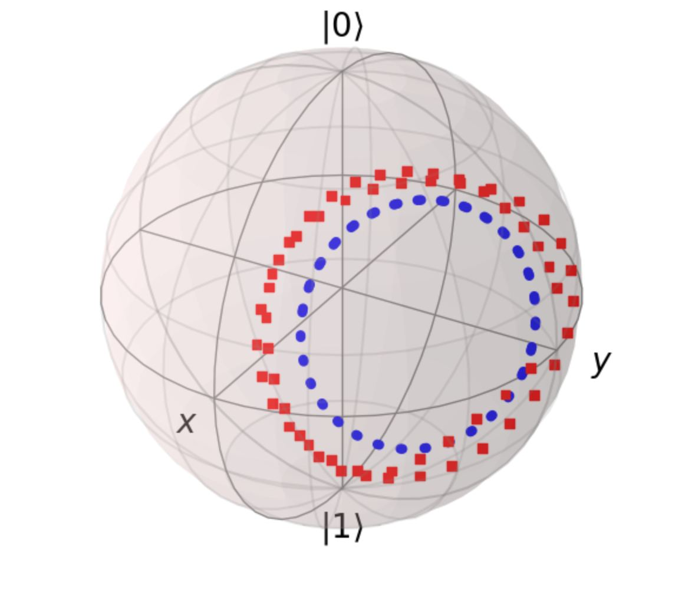

## QNODE: Learning quantum dynamics using latent neural ODEs vers 1
https://arxiv.org/abs/2110.10721

## Abstract
The  motivation of this project was written in the state above, few words about my work : 
In this project I try to train QNODE on real experimental data, in order to obtain a model that can predict the dynamics of a qubits, the resulting density matrix can be used for other performance calculations.
I wish I could use model for calculations on  two or  multiple qubits

## Work
In work i used the code in the state above, and increase some fragments.

1. The initial step is - check model on one cubit 

The state of a qubit can be represented on a Bloch sphere

Below you can see results in training process 

## Result
# Loss & Elbo

# Bloch Sphere Train & Test
 

## Review
Until now, we rewrite functions, dataset and model in order to increase quality of results

